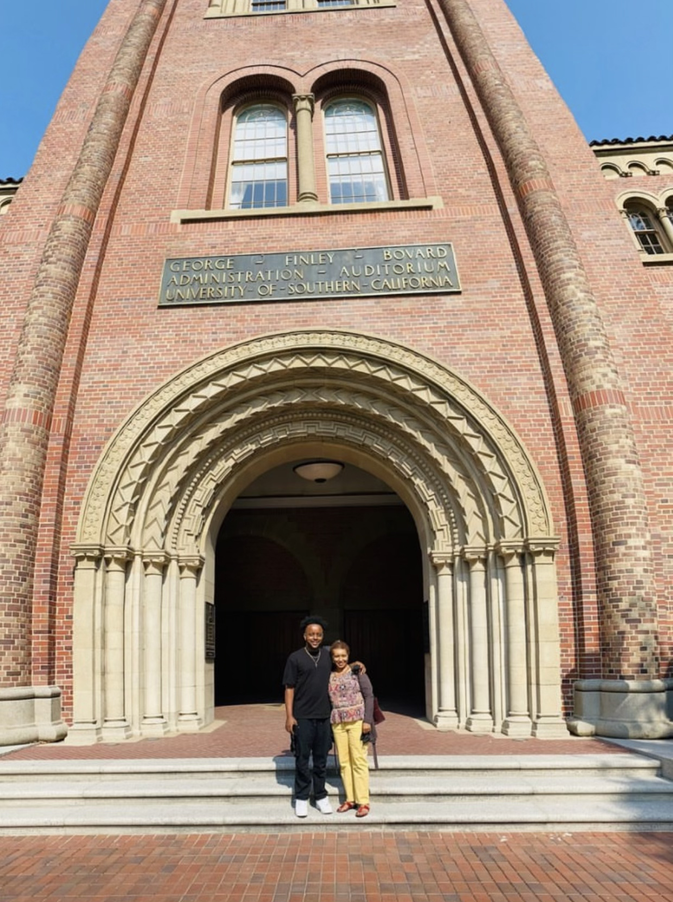

  <samp>
    
     
    👋🏽 Hey there! My name is Bereket Kibret.
      
     
    I work in engineering at .
     
      
    🌇 Born and raised in Gondar, Ethiopia, I am currently living in the vibrant city of Los Angeles, California.
      
    🎓 I am a dedicated student in the Computer Science Program at the University of Southern California (USC), where I have gained a solid 
academic foundation in various aspects of computer science and software development.
      
    💼 In addition to my academic pursuits, I have been actively involved in the tech industry, gaining valuable experience and working with in a big tech and a few startups. Through these experiences, I have honed my skills in areas such in software engineering.
      
    💡 Passionate about technology and its potential to make a positive impact, I am driven to using all that I have learned to better the 
world!
      
    <i>❤️ Here is a picture of my mom and i when I moved into USC. She is my why behind it all.</i>
      
    
      
    🌐 To learn more about my professional background, connect with me on <a href="https://www.linkedin.com/in/bereketkibret/" target="_blank">LinkedIn</a>
      
    📬 Feel free to reach out to me at <a href="mailto:kibret@usc.edu">kibret@usc.edu</a>. I'm always excited to connect and explore new opportunities.
  </samp>

